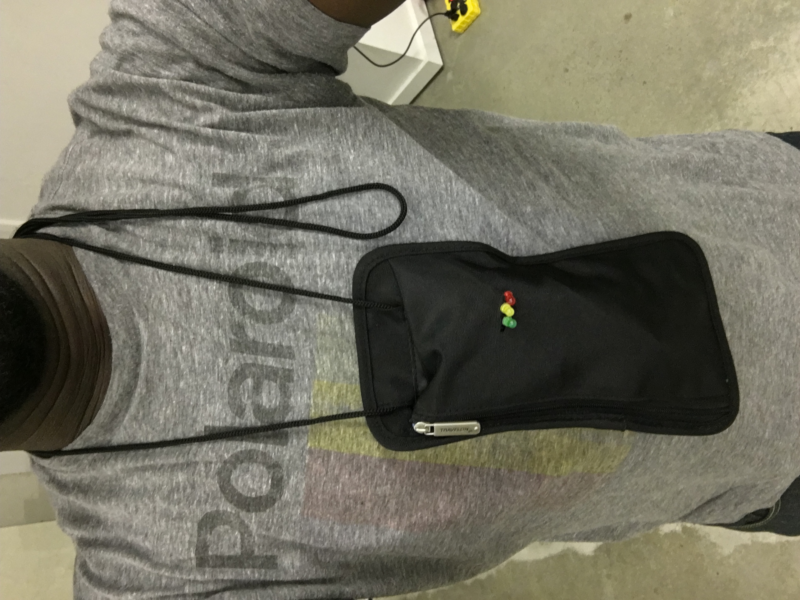
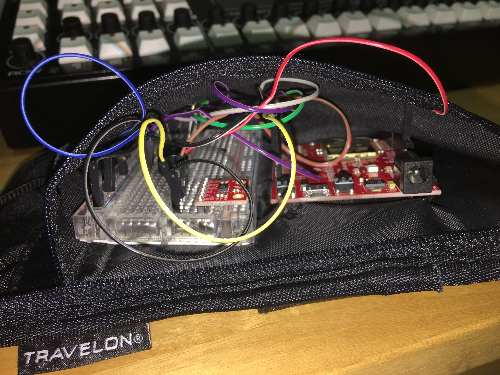

# Midterm IoT Project

Name: Quran Karriem

Date: October 12, 2017

## Project: TumbleText

### Conceptual Description

In studying cloud-connected baby monitors (like those from iBaby Labs), I was struck by the combination of potentially useless data flows, ability to affect a child's physical space from the cloud (e.g. from a speaker on the device), and generally poor security. There are several instances of the devices being hacked into. Hackers have turned them into spy cams and used them to scream obscenities at children. https://splinternews.com/watch-out-new-parents-internet-connected-baby-monitors-1793850489 The technology also seems to espouse tacit encouragement of absentee parenting. TumbleText is a wearable device that sends text messages to parents (and any one subscribed) whenever a child falls down. The device uses an accelerometer to detect a fall, and Particle.publish to send data about "speed" or severity of the fall. I'd envision such a product marketed to parents as a tool to keep their child safe, but actually used for the manufacturer's benefit. In using a broadcast-style data stream to document a child's falls, the device intentionally makes data of questionable utility to the caretaker (a child will make it abundantly clear whether they are OK after a fall, and a flashing LED is an intentionally useless technological indication that a child is falling.), but that anyone monitoring the data stream (for instance, child protective services) can use to make decontextualized inferences about the quality of care a child receives. 

### Form

TumbleText is a wearable. I modified a passport holder to contain the Photon, battery and breadboard. The prototype is small enough to be worn by an adult, but not enough to be reasonably worn by a toddler. This was a limitation of using the Photon Redboard. A standard-issue Photon or ESB would be much smaller, as would a soldered solution. In the current form, the exposed LEDs would be immediately probed and and decontructed by a child. Here I'm expressing a productized eagerness to add bells and whistles (and collect data) without thought to use cases. In terms of the presentation of the prototype in class, I inserted a foam board at the back of the enclosure to prevent the Redboard from being damaged in drop testing.

**Finished Enclosure:**



**Electronics Exposed:**



### Technical Details
Hardware used:
* MMA8452Q Accelerometer
* 1 Red, 1 Yellow, 1 Green LED
* Photon RedBoard
* Mini Speaker - PC Mount 12mm 2.048kHz

Code:
[photon.ino](photon.ino)

Wiring Diagram:


To detect falls, TumbleText uses a data stream from the MMA8452Q accelerometer. The device detects gravitational force at its X, Y and Z axes, such that sitting at rest on a perfectly flat surface, it should detect 0.00G at X and Y, and 1.00G at Z. Flipping the device over on the same surface would show (0.00, 0.00, -1.00) at X, Y and Z, respectively. Z goes negative in this case because gravitational force is being applied to the bottom of the device, rather than the top. Similarly, turning the device on its side might result in a +/- 1.00 value at the X or Y position, and a 0.00 and Z. Various rotational positions result in different combinations of G values at X, Y and Z. And this is how the device determines its orientation. 

Since I'd determined to simply detect falls, I wasn't concerned with device orientation. After some experimentation with the data flows, I observed that values were lower while the device was falling (e.g. less gravitional force is exerted on the device while it moves in the same direction). With this in mind, I ended up setting thresholds and monitoring the to indicate the severity of a fall:

```
if (x < hiThreshold && y < hiThreshold && z < hiThreshold){
  fallIndicator(hiPin, hiFreq, hiFallMessage);
}
```
This method detects falls, but not impacts, which might be detected when a single value has exceeded a threshold. I wanted to avoid damaging components (especially before I had an enclosure), so detecting falls seemed like a better idea than impacts.

To do fall detection, I had to account for negative values due to device rotation; I got a lot of false positives just by turning the device upside down (and burned through my allotment of free SMS messages on IFTTT in a day and had to switch to app notifications). I had some difficulties with the built-in abs() function in Arduino, and eventually just ended up using if statements instead, e.g.:
```
if (x < 0){x = -x;} //ignore rotation data in determining fall status
```

Once I had a reliable way to detect falls, it was simple to output sounds, lights and IFTTT notifications.
```
void fallIndicator(int pin, int freq, String message){
  digitalWrite(pin, HIGH);
  delay(150);
  digitalWrite(pin, LOW);
  tone(soundPin, freq, 500);
  Particle.publish("fallSeverity", message, 5);
  Serial.println(message);
}
```


